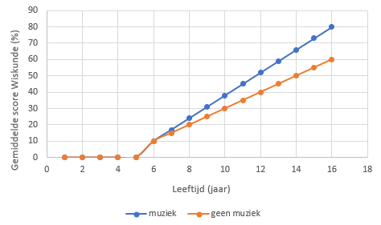

# Hypothese

## Onderzoeksvraag

Heeft het bespelen van een intstrument invloed op de wiskundige geletterdheid?

## Toelichting

Mensen die een instrument spelen krijgen volgens ons vroeger bepaalde inzichten die hun helpen positiever wiskundig inzicht te verkrijgen.  
Door het spelen van muziek stimmuleer je ook de hersenen die op deze manier al beter getraind zijn om taken uit te voeren die ook bij wiskunde gebruikt worden.   
Muziek spelen vergt ook veel oefening en geduld wat ook benodigd is om wiskunde onder de knie te krijgen.   

## Selectie variabelen

onafhankelijke variabele(n) : Musical instrument, music education, music years, sheet music  
afhankelijke variabele(n) : MathPrep, SecondaryMathResults, GradeMath4IT, GradePOD1  

## Schets verwachte resultaten

## Bronnen

https://www.standaard.be/cnt/dmf20190624_04477357    
https://limo.libis.be/primo-explore/fulldisplay?docid=LIRIAS1708230&context=L&vid=Lirias&search_scope=Lirias&tab=default_tab&lang=en_US&fromSitemap=1   
https://www.nu.nl/wetenschap/2497851/muziek-maken-houdt-brein-scherp.html   
https://onlinemuziekacademie.nl/muziekinstrument-leren-spelen-latere-leeftijd/   
